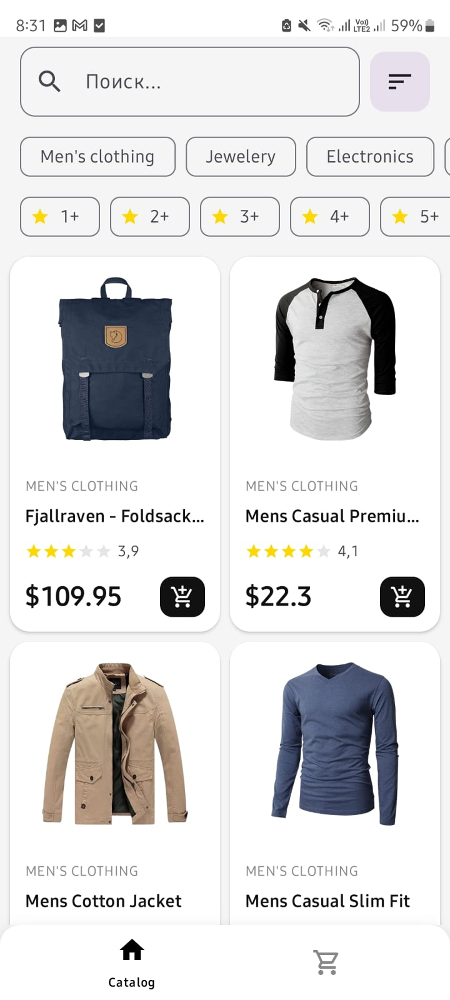
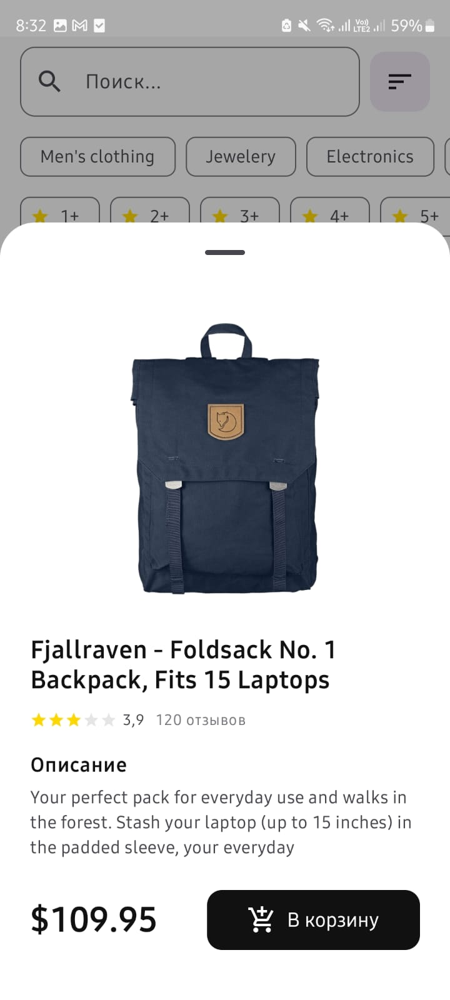
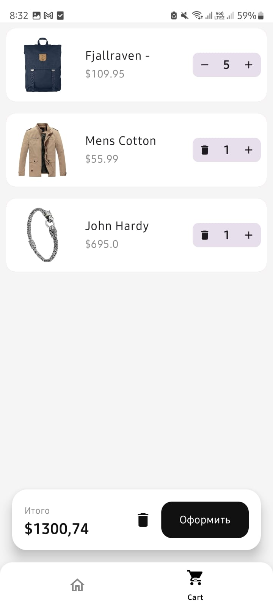

# 🛒 Shop Magazine

**Shop Magazine** is a full-featured e-commerce Android application demonstrating a robust **Offline-first** approach and modern state management. The app features a dynamic product catalog, advanced filtering/sorting, a reactive shopping cart, and secure user authentication via DataStore and Interceptors.

## 🚀 Key Features

* **Dynamic Catalog:** Fetches high-quality product data from the FakeStore API.
* **Advanced Filtering & Sorting:** Users can filter products by category, rating, and search queries, or sort by price, alphabet, and popularity.
* **Reactive Shopping Cart:** A fully functional cart with the ability to add, increment, decrement, and remove items with real-time total price calculation.
* **Offline Support (Single Source of Truth):** Uses Room Database to cache products and cart items, ensuring the app remains functional without an internet connection.
* **Secure Auth & Session Management:**
    * JWT Token storage using **Jetpack DataStore**.
    * **AuthInterceptor** for automatic header injection in API requests.
* **Unit & UI Testing:** Comprehensive test suite for DAOs, Repositories, and ViewModels using MockK and Google Truth.

## 🏗 Architecture & Patterns

The project follows **Clean Architecture** principles combined with **MVI/MVVM** patterns:

1.  **Presentation Layer:** Built with **Jetpack Compose**. Uses `StateFlow` and `combine` operators to merge multiple data streams (search, filters, database) into a single UI State.
2.  **Domain Layer:** Defines the business logic and repository interfaces, ensuring the app is independent of external frameworks.
3.  **Data Layer:** Handles data coordination between the **Retrofit** REST API and **Room** local storage.

## 🛠 Tech Stack

* **UI:** Jetpack Compose (Material 3).
* **Dependency Injection:** Dagger Hilt.
* **Database:** Room (with Foreign Keys and Transactions).
* **Networking:** Retrofit 2 & GSON.
* **Preferences:** Jetpack DataStore.
* **Concurrency:** Kotlin Coroutines & Flow (Debounce, Combine, stateIn).
* **Testing:** MockK, JUnit4, Google Truth, Robolectric.

## 📸 Screenshots

| Product Catalog | Product Details | Filters & Sort | Shopping Cart |
|:---:|:---:|:---:|:---:|
|  |  |  |  |

## 🧪 Testing Overview

The project includes:
* **CartDaoTest:** Validating database transactions and data integrity.
* **ProductRepositoryImplTest:** Mocking network responses to verify data flow and error handling.
* **CatalogViewModelTest:** Testing UI state logic, filtering, and sorting algorithms.

## 👨‍💻 Author
**Ramiz Galiakberov**
* Android Developer
* Astana, Kazakhstan
